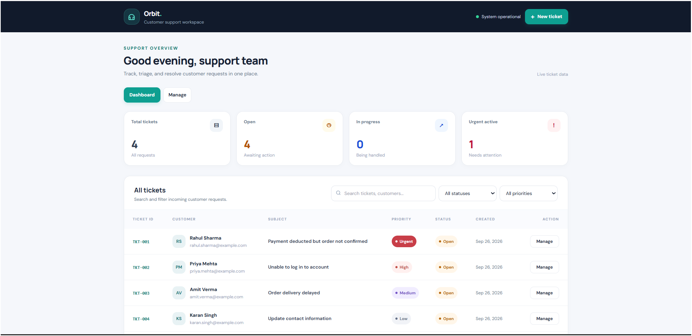
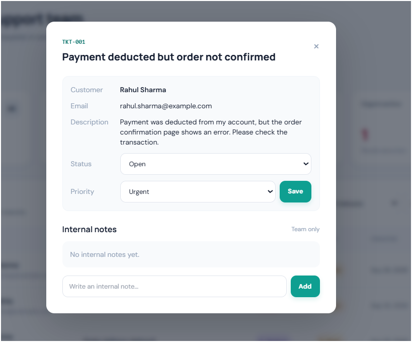
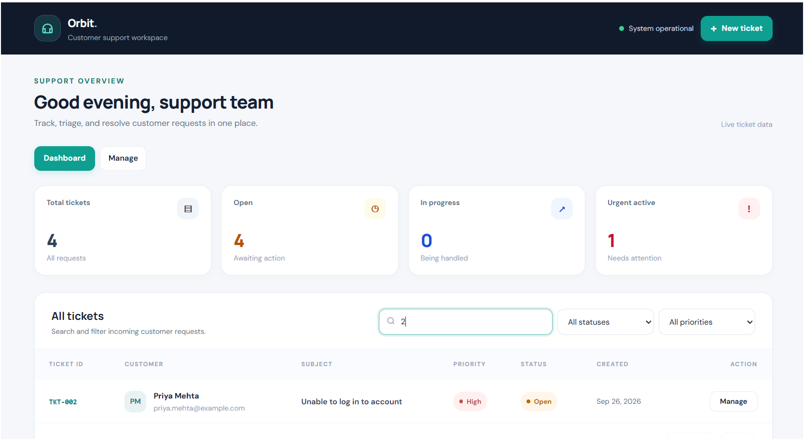
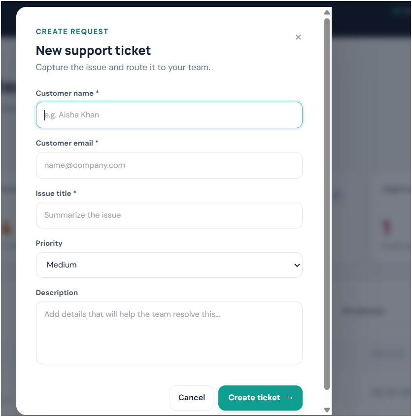
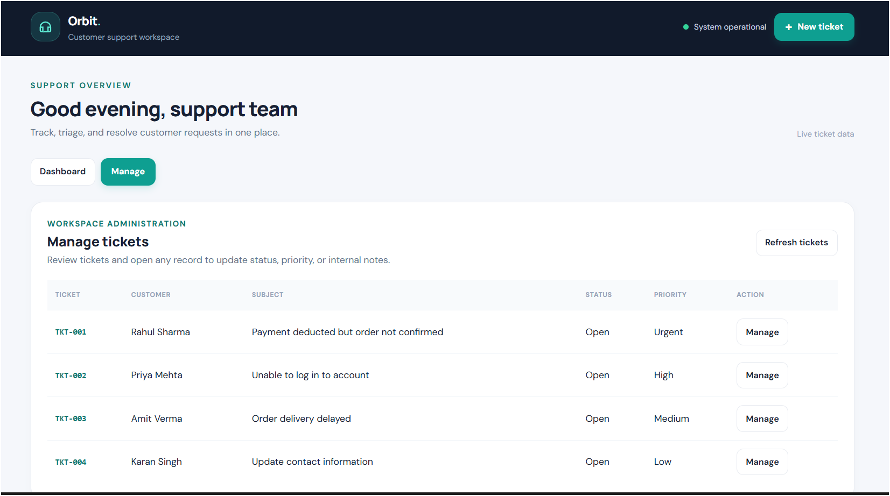

# Orbit Support Desk

A responsive, full-stack customer support ticket CRM built for the DataStraw assessment.

**Live Demo:** [https://orbit-support-desk.onrender.com/](https://orbit-support-desk.onrender.com/)

Orbit Support Desk includes ticket creation, searchable and filterable queues, ticket details, status and priority updates, internal notes, live ticket metrics, and pagination.

## Screenshots

### Dashboard


### Ticket Details and Internal Notes


### Search and Filters


### Create New Ticket


### Manage Tickets


## Stack

- Node.js + Express 5 REST API
- PostgreSQL via the Neon Postgres connection string in `DATABASE_URL`
- HTML, vanilla JavaScript, Tailwind CSS CDN, and custom responsive CSS
- Jest + Supertest API tests

## Features

- Create support tickets with customer name, email, title, description, and priority.
- Browse tickets, sorted by priority (Urgent, High, Medium, Low) and then newest first.
- Search by ticket ID, customer name, email, subject, or description.
- Filter by status and priority, with server-side pagination.
- Open ticket details, update status and priority, and append internal notes.
- Dashboard counters for total, open, in-progress, and urgent active tickets.
- Manage workspace for ticket operations, without a People or Team directory.
- Responsive mobile layout, keyboard-accessible ticket rows, Escape/backdrop modal close, validation, and success/error feedback.

## Run Locally

Use Node.js 20 or newer.

```bash
npm install
cp .env.example .env.local
# Windows PowerShell:
Copy-Item .env.example .env.local
# Fill in your PostgreSQL/Neon DATABASE_URL value
npm start
```

Open [http://localhost:3000](http://localhost:3000).

The app expects a Postgres connection string via `DATABASE_URL`. Do not commit `.env.local` or any secret values. The repository keeps `.env.example` limited to placeholders only.

## Demo dataset safety

The project currently contains test records created during API validation. Do not delete or truncate production data.

For a clean local demo, use a development-only script that inserts fictional sample tickets and refuses to run in production:

```bash
ALLOW_DEMO_SEED=1 NODE_ENV=development npm run demo:seed
```

This script only inserts a small set of fictional customer records into a local development database. It exits early if `NODE_ENV=production` or if the target database already contains a meaningful amount of real data, so it cannot silently wipe or mutate production records.

## Tests

```bash
npm test -- --runInBand
```

The Jest/Supertest suite exercises ticket creation and validation, listing, search, filters, pagination headers, detail retrieval, updates, notes, and stats.

## REST API

| Method | Endpoint | Purpose |
|---|---|---|
| `POST` | `/api/tickets` | Create a ticket. Required JSON: `customer_name`, `customer_email`, `subject`; optional: `description`, `priority`. |
| `GET` | `/api/tickets?search=&status=&priority=&page=&limit=` | Search, filter, and paginate tickets. Returns a JSON array and `X-Total-Count`, `X-Page`, `X-Total-Pages` headers. |
| `GET` | `/api/tickets/:ticket_id` | Get ticket details and notes. |
| `PUT` | `/api/tickets/:ticket_id` | Update `status` and/or `priority`, and/or add a note using `notes`. |
| `GET` | `/api/stats` | Return ticket counts by status and urgent non-closed count. |

Allowed statuses: `Open`, `In Progress`, `Closed`. Allowed priorities: `Low`, `Medium`, `High`, `Urgent`.

## Deployment

The application is deployed on Render: [Open the live app](https://orbit-support-desk.onrender.com/).

For a Render Web Service, use the repository root with:

- **Build command:** `npm install`
- **Start command:** `npm start`
- **Root directory:** leave blank when the app files are at the repository root

This project is a single Express service, so there is no separate frontend build step.

## Architecture and Scope

The schema intentionally uses `tickets`, `notes`, and `ticket_requests` tables. Authentication, agent assignment, email notifications, and SLA automation are not included in this MVP, consistent with the assignment's instruction to keep authentication basic or omit it.

## Manage Workspace

The Manage workspace provides a ticket operations table. Open a ticket to edit its status, priority, and internal notes. The application does not include a People directory, team roster, or user-access administration.
